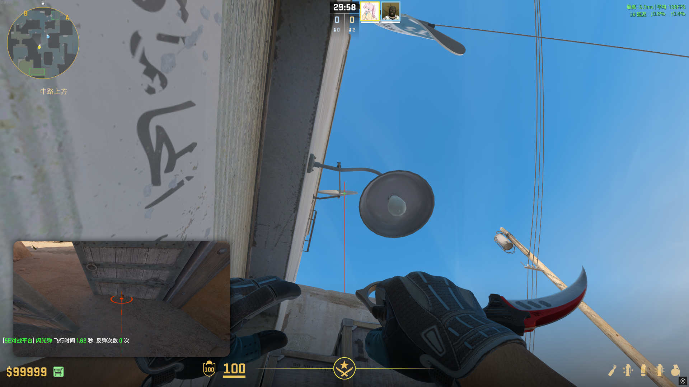
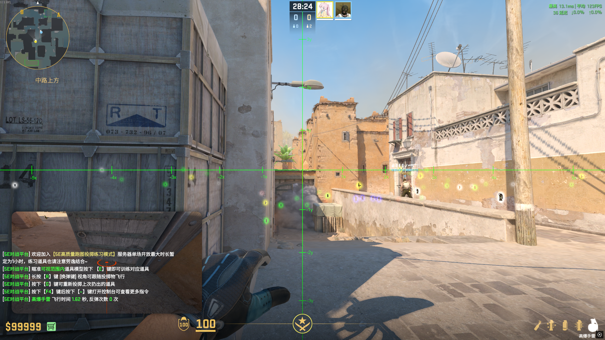
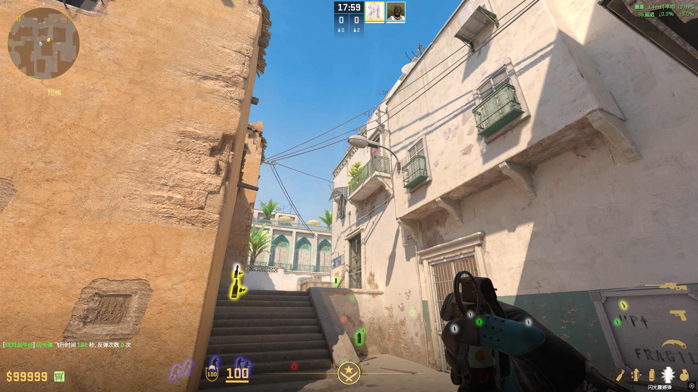
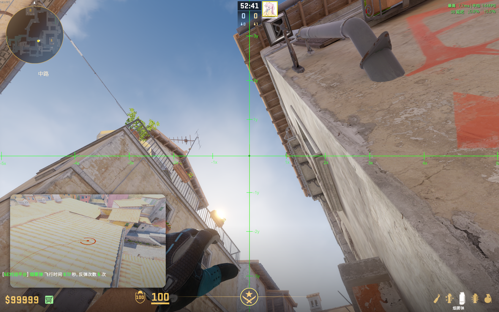
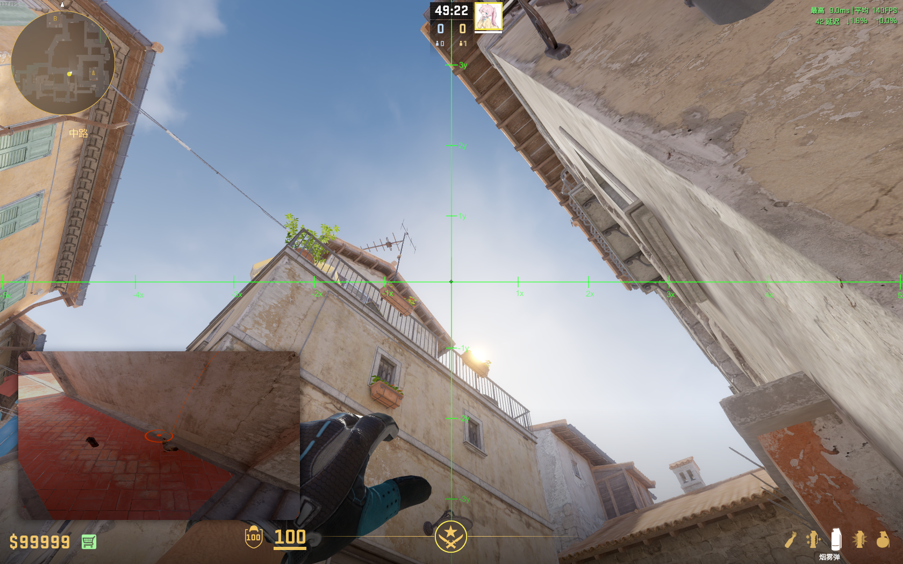

# 静步走半步丢

# T(A)

<!-- Slide number: 11 -->

#

<!-- Slide number: 12 -->

#

<!-- Slide number: 13 -->

#

<!-- Slide number: 14 -->

#

<!-- Slide number: 15 -->

#

<!-- Slide number: 16 -->

#

<!-- Slide number: 17 -->

#

<!-- Slide number: 18 -->

#

<!-- Slide number: 19 -->

#

<!-- Slide number: 20 -->
# T(B)

<!-- Slide number: 21 -->

#

<!-- Slide number: 22 -->

#

<!-- Slide number: 23 -->

#

<!-- Slide number: 24 -->

#

<!-- Slide number: 25 -->
#

<!-- Slide number: 26 -->

#

<!-- Slide number: 27 -->
#

<!-- Slide number: 28 -->

#

<!-- Slide number: 29 -->

#

<!-- Slide number: 30 -->

#

<!-- Slide number: 31 -->
#

<!-- Slide number: 32 -->

# CT(B)

<!-- Slide number: 33 -->

#

<!-- Slide number: 34 -->

#

<!-- Slide number: 35 -->

#

<!-- Slide number: 36 -->

#

<!-- Slide number: 37 -->

#

<!-- Slide number: 38 -->

#

<!-- Slide number: 39 -->

#

<!-- Slide number: 40 -->

# T(中)

<!-- Slide number: 41 -->

#

<!-- Slide number: 42 -->

# T(B)